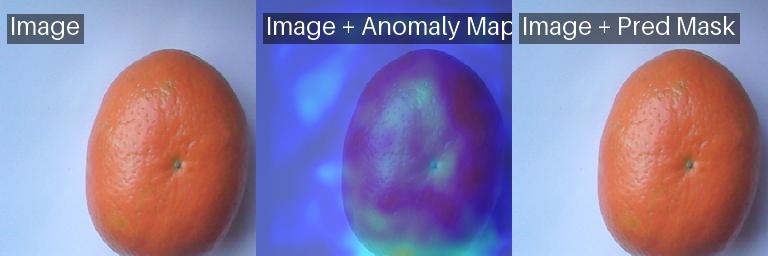
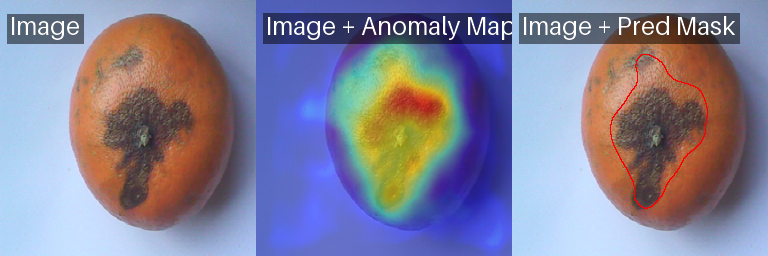

#  :orange_circle:

An anomaly detection project built around mandarin images, originally developed as a final degree thesis and later rebuilt as a modern, reproducible `anomalib` pipeline.

This repository intentionally preserves both:

- a historical reconstruction of the original thesis work
- a modern implementation in `Python 3.12` with `anomalib 2.4.1`

## Why this repository exists

The original project studied visual anomaly detection through `anomalib`, benchmarked several image-based methods, and closed with a small IoT-style mandarin inspection scenario inspired by `PYNQ-Z2`.

Three years later, the project was revisited and rebuilt with a cleaner engineering setup:

- `src/`-based package structure
- deterministic dataset splits
- benchmark scripts
- final training and inference scripts
- report notebooks and exported HTML artifacts

The goal is not only to preserve the academic project, but to turn it into a public, readable, reproducible portfolio repository.

## Highlights

- Historical baseline traced back to `anomalib 0.3.7`
- Modern pipeline built with `Python 3.12` and `anomalib 2.4.1`
- Canonical mandarin dataset with normal and anomalous cropped images
- Reproducible multi-seed benchmark
- Final inference examples with visual anomaly outputs
- Public-ready repository structure with lightweight tracked artifacts

## Quick Results

### Modern benchmark

Models benchmarked on `data/mandarins_pynq_cropped`:

- `PatchCore`
- `AnomalyDINO`

Current leaderboard:

| Model | Mean AUROC | Mean AUPR | Mean F1 | Mean latency (ms) |
| --- | ---: | ---: | ---: | ---: |
| PatchCore | 0.9333 | 0.9398 | 0.8407 | 173.66 |
| AnomalyDINO | 0.7867 | 0.8111 | 0.5516 | 106.28 |

Winner:

- `PatchCore`

Final training summary on the locked `seed=42` setup:

- `image_AUROC`: `0.9200`
- `image_AUPR`: `0.9267`
- `image_F1Score`: `0.8333`
- `latency_ms`: `220.39`

## Demo Outputs

Modern inference artifacts are already included in the repository:

- [Benchmark report HTML](docs/html/modern/modern_benchmark_report.html)
- [Inference demo HTML](docs/html/modern/modern_inference_demo.html)
- [Presentation landing page](docs/index.html)
- [Prediction table](artifacts/modern/predictions/folder_predictions.csv)

Example visual outputs:

| Normal prediction | Anomalous prediction |
| --- | --- |
|  |  |

## Repository Structure

```text
.
├── artifacts/modern/        # Public benchmark summaries, prediction tables, lightweight visuals
├── configs/modern/          # Dataset, model, benchmark and final-train YAML configs
├── data/                    # Mandarin datasets and inference samples
├── docs/                    # Thesis PDFs, extracted text, reconstruction notes, exported HTML
├── legacy/                  # Historical archived material, including the old anomalib snapshot
├── notebooks/               # Historical notebooks + modern report notebooks
├── notes/                   # Small auxiliary notes/configs kept for context
├── src/mandarine/           # Modern Python package
└── tests/                   # Lightweight tests for splits and configs
```

## Dataset

The canonical dataset for the modern experiment is:

- `data/mandarins_pynq_cropped`

It contains:

- `33` normal images
- `7` anomalous images

Other preserved data folders:

- `data/mandarins_pynq_raw`: raw examples and historical context
- `data/mandarins_pynq_augmented`: legacy-only material, not used in the modern pipeline
- `data/webcam_inference_images`: inference demo images

## Two Project Layers

### 1. Historical layer

The historical part of the repository exists for traceability and documentation.

- Reference version: `anomalib 0.3.7`
- Intended environment: `Python 3.8`
- Dependency file: `requirements-legacy.txt`

The old partial local `anomalib` copy was removed from the repository root and archived under:

- [legacy/anomalib_snapshot](legacy/anomalib_snapshot)

That keeps the history available without polluting imports in the modern pipeline.

### 2. Modern layer

The modern layer uses:

- `Python 3.12`
- `anomalib 2.4.1`
- structured configs
- deterministic train/val/test splits
- scriptable benchmark, training, inference and reporting

## Experimental Protocol

- Base dataset: `data/mandarins_pynq_cropped`
- Fixed seeds: `13`, `23`, `42`
- Per-seed split:
  - normal images: `23` train, `5` val, `5` test
  - anomalous images: `2` val, `5` test
- No anomalous images are used during training
- Augmentations are applied only on-the-fly to normal training images
- Winner selection rule:
  - highest mean `image_AUROC`
  - tie-break on mean `image_AUPR`
  - final tie-break on lower latency

## Installation

### Modern environment

```powershell
py -3.12 -m venv .venv-modern
.venv-modern\Scripts\activate
python -m pip install --upgrade pip
python -m pip install -r requirements-modern.txt
```

The modern requirements install the local package in editable mode, so all `python -m mandarine...` commands work without manual `PYTHONPATH` setup.

### Historical environment

```powershell
py -3.8 -m venv .venv
.venv\Scripts\activate
python -m pip install --upgrade pip
python -m pip install -r requirements-legacy.txt
python -m pip install anomalib==0.3.7 --no-deps
```

## Modern Pipeline

### 1. Prepare deterministic splits

```powershell
python -m mandarine.data.prepare
```

### 2. Run the benchmark

```powershell
python -m mandarine.experiments.benchmark
```

Lighter CPU-only examples:

```powershell
python -m mandarine.experiments.benchmark --models patchcore anomalydino
python -m mandarine.experiments.benchmark --models patchcore --seeds 42
```

### 3. Retrain the winning model

```powershell
python -m mandarine.experiments.train_final
```

### 4. Run folder inference

```powershell
python -m mandarine.inference.predict_folder
```

### 5. Build reports and HTML

```powershell
python -m mandarine.reporting.build_report
```

## Public Artifacts Kept in Git

To keep the repository public-friendly and lightweight, only compact and useful modern artifacts are tracked:

- `artifacts/modern/benchmark/*.csv`
- `artifacts/modern/benchmark/metrics_summary.json`
- `artifacts/modern/benchmark/figures/*.png`
- `artifacts/modern/final_model/final_model_summary.json`
- `artifacts/modern/predictions/*.csv`
- `artifacts/modern/predictions/*.json`
- `artifacts/modern/predictions/visualizations/*.png`

Heavy training directories, checkpoints, caches and duplicated generated images are intentionally ignored.

## Notebooks

### Historical notebooks

- `notebooks/tfg_experiments.ipynb`
- `notebooks/model_boosting_experiments.ipynb`
- `notebooks/iot_orange_experiments.ipynb`

### Modern notebooks

- `notebooks/modern_benchmark_report.ipynb`
- `notebooks/modern_inference_demo.ipynb`

The modern notebooks are report-oriented: they read generated artifacts rather than training models directly.

## Tests

```powershell
pytest
```

Current tests cover:

- deterministic split generation
- expected split counts
- no anomaly leakage into train
- config loading and path resolution

## Known Limitations

- The current benchmark is CPU-first because no GPU is available in this machine context
- `EfficientAd` is supported in the modern configuration but is heavier to prepare because it downloads auxiliary assets such as `Imagenette`
- The mandarin dataset does not include segmentation masks, so evaluation is image-level rather than pixel-level

## Core Documentation

- `docs/tfg_memoria.pdf`
- `docs/tfg_memoria.full.txt`
- `docs/tfg_presentacion.pdf`
- `docs/tfg_presentacion.full.txt`
- `docs/reconstruction_notes.md`

## License

This repository code is released under the [MIT License](LICENSE).

The thesis PDFs and historical academic materials are preserved as project context.
